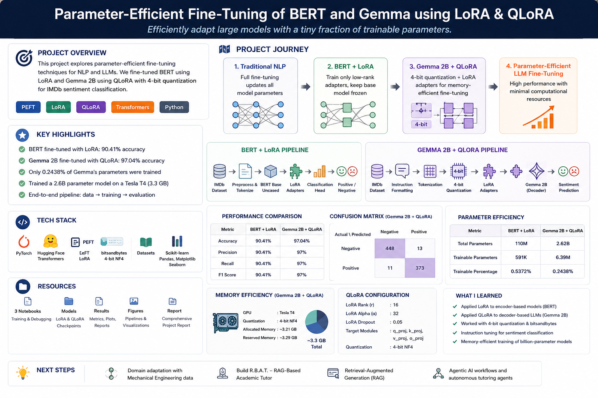
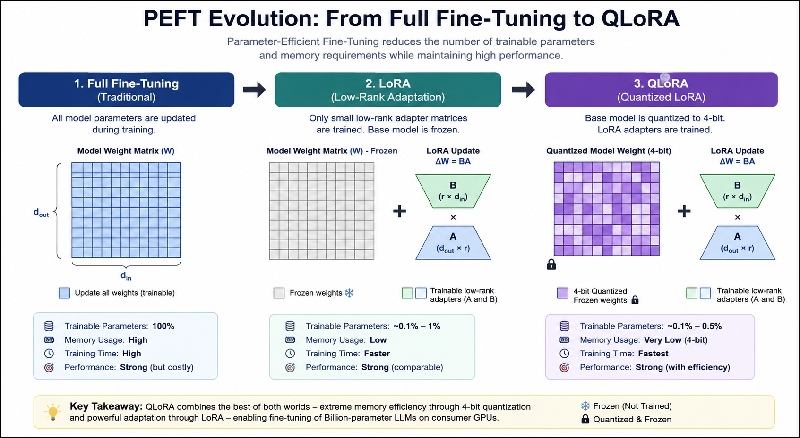
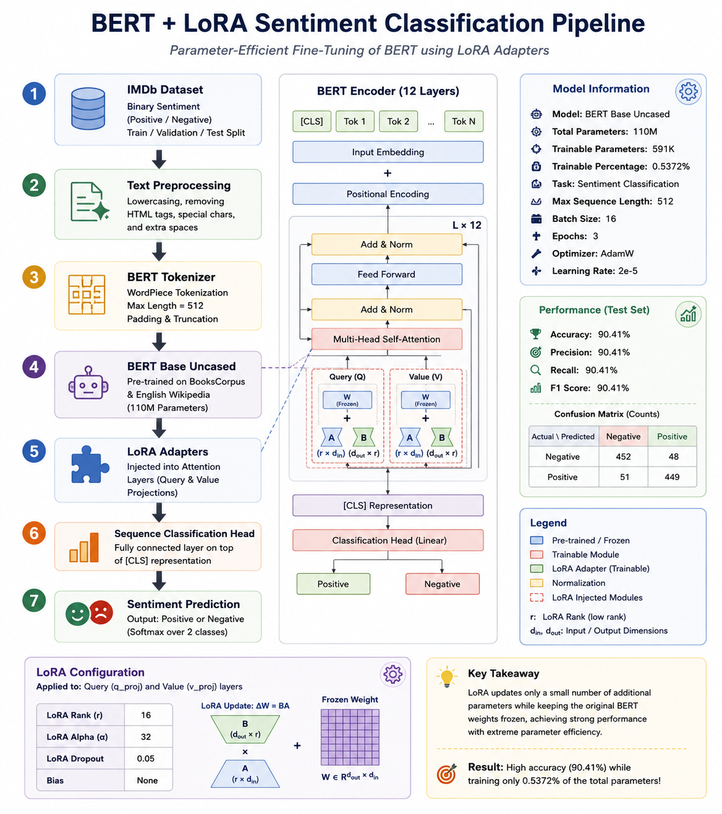
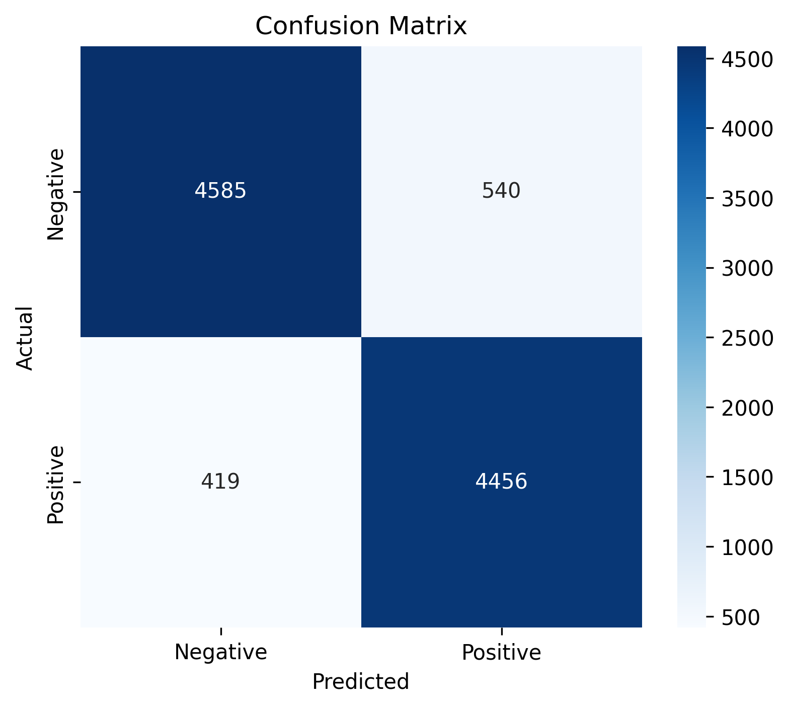
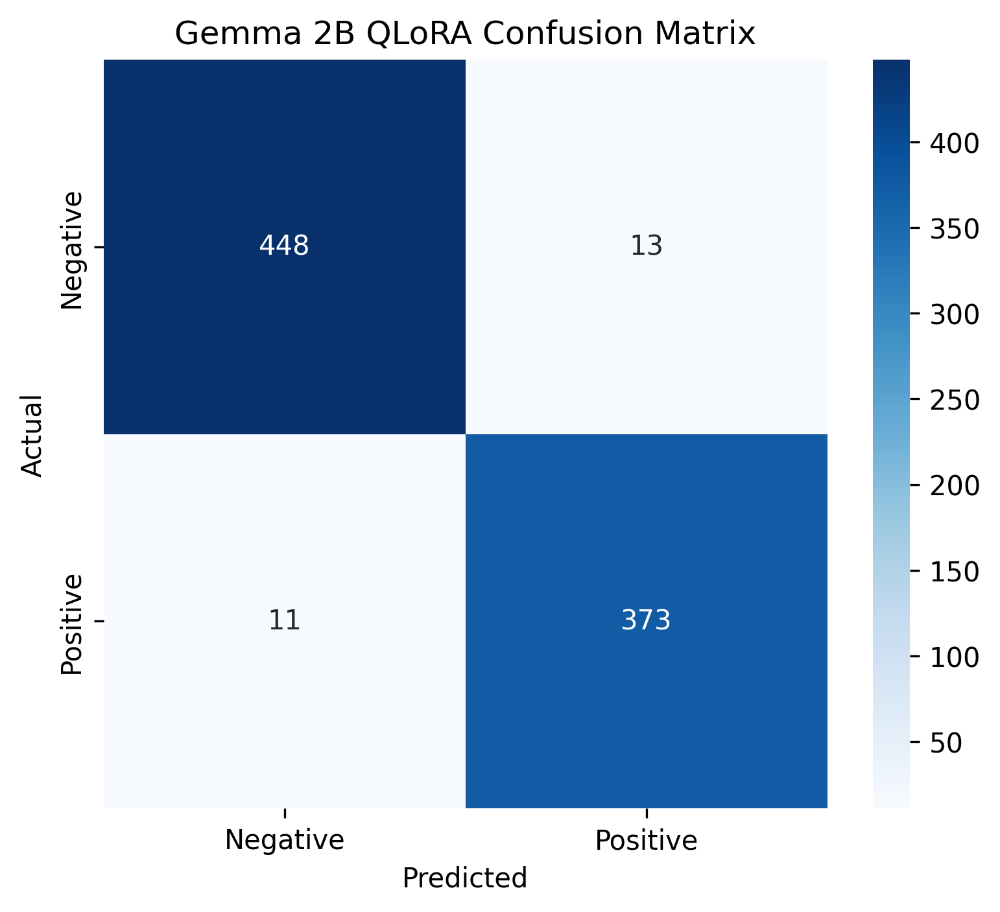

# 🚀 Parameter-Efficient Fine-Tuning of BERT and Gemma using LoRA & QLoRA

> Efficiently adapt large language models while training only a tiny fraction of their parameters.

---

## 📌 Project Overview

This project explores **Parameter-Efficient Fine-Tuning (PEFT)** techniques for Natural Language Processing (NLP) and Large Language Models (LLMs).

The project begins by applying **LoRA (Low-Rank Adaptation)** to a BERT-based sentiment classification model and extends the workflow to **Gemma 2B** using **QLoRA (Quantized Low-Rank Adaptation)** with 4-bit quantization.

The goal is to demonstrate how modern PEFT techniques can significantly reduce computational and memory requirements while maintaining strong task performance.

---

## 🎯 Objectives

* Fine-tune BERT using LoRA for sentiment classification
* Fine-tune Gemma 2B using QLoRA
* Compare parameter efficiency and memory efficiency
* Demonstrate billion-parameter model adaptation on commodity GPUs
* Evaluate both encoder-based and decoder-based PEFT workflows

---

## 🖼️ Project Summary

<p align="center">
  
</p>

*Figure 1. Overall project summary and key results.*

---

# 🧠 Understanding PEFT

Parameter-Efficient Fine-Tuning (PEFT) enables adaptation of large language models by training only a small subset of parameters while keeping the majority of the model frozen.

---

## PEFT Evolution

<p align="center">
  
</p>

*Figure 2. Evolution from Full Fine-Tuning to LoRA and QLoRA.*

---

# 📂 Dataset

### IMDb Sentiment Dataset

* Binary Sentiment Classification
* Positive and Negative Movie Reviews

| Split      | Samples |
| ---------- | ------: |
| Train      |   8,000 |
| Validation |   2,000 |
| Test       |  10,000 |

---

# 🔹 Part 1: BERT + LoRA

## Architecture

BERT Base Uncased was fine-tuned using LoRA adapters inserted into transformer attention layers.

<p align="center">
  
</p>

*Figure 3. BERT + LoRA sentiment classification pipeline.*

---

## LoRA Configuration

| Parameter           | Value |
| ------------------- | ----: |
| LoRA Rank (r)       |    16 |
| LoRA Alpha          |    32 |
| LoRA Dropout        |  0.05 |
| Max Sequence Length |   512 |
| Epochs              |     3 |

---

## Results

| Metric               |   Value |
| -------------------- | ------: |
| Accuracy             |  90.41% |
| F1 Score             |  90.41% |
| Total Parameters     |    110M |
| Trainable Parameters |    591K |
| Trainable Percentage | 0.5372% |


## Confusion Matrix

<p align="center">
  
</p>

*Figure 4. BERT LoRA evaluation results.*
---

# 🔹 Part 2: Gemma 2B + QLoRA

## Architecture

Gemma 2B was loaded using 4-bit NF4 quantization and fine-tuned using QLoRA adapters.

<p align="center">
  
</p>

*Figure 5. Gemma 2B QLoRA fine-tuning workflow.*

---

## Instruction Tuning Format

```text
### Instruction:
Classify the sentiment of the following movie review.

### Review:
This movie was excellent.

### Response:
Positive
```

---

## QLoRA Configuration

| Parameter      |                          Value |
| -------------- | -----------------------------: |
| Quantization   |                      4-bit NF4 |
| LoRA Rank (r)  |                             16 |
| LoRA Alpha     |                             32 |
| LoRA Dropout   |                           0.05 |
| Target Modules | q_proj, k_proj, v_proj, o_proj |
| Epochs         |                              1 |

---

## Results

| Metric               |   Value |
| -------------------- | ------: |
| Accuracy             | 97.04%* |
| Precision            |     97% |
| Recall               |     97% |
| F1 Score             |     97% |
| Trainable Parameters |   6.39M |
| Trainable Percentage | 0.2438% |

* Computed on valid generated predictions that could be confidently mapped to sentiment labels(845/1000).

---

## Confusion Matrix

<p align="center">
  
</p>

*Figure 6. Gemma 2B QLoRA evaluation results.*

---

# 📊 BERT vs Gemma Comparison

| Metric               | BERT + LoRA | Gemma 2B + QLoRA |
| -------------------- | ----------: | ---------------: |
| Model Type           |     Encoder |      Decoder LLM |
| Total Parameters     |        110M |            2.62B |
| Trainable Parameters |        591K |            6.39M |
| Trainable Percentage |     0.5372% |          0.2438% |
| Accuracy             |      90.41% |          97.04%* |
| F1 Score             |      90.41% |             97%* |

---

# ⚡ Memory Efficiency

| Metric           |     Value |
| ---------------- | --------: |
| GPU              |  Tesla T4 |
| Quantization     | 4-bit NF4 |
| Allocated Memory |  ~3.21 GB |
| Reserved Memory  |  ~3.29 GB |

Despite containing over **2.6 billion parameters**, Gemma 2B was successfully fine-tuned on a single Tesla T4 GPU.

## BERT vs Gemma Comparison Chart

<p align="center">
  
</p>

*Figure 7. BERT vs Gemma Comparison Chart.*

---

# 🛠️ Technologies Used

* Python
* PyTorch
* Hugging Face Transformers
* PEFT
* LoRA
* QLoRA
* BitsAndBytes
* Datasets
* Scikit-Learn
* Pandas
* Matplotlib
* Seaborn

---

# 🔍 Engineering Notes

An initial attempt was made to apply QLoRA directly to BERT.

Although quantization and adapter injection were successful, training encountered compatibility issues related to bitsandbytes 4-bit quantization and encoder-based architectures.

The debugging workflow has been retained in the repository:

```text
BERT_PEFT_QLoRA_Debugging_Draft.ipynb
```

This exploration provided valuable insights into the differences between encoder-based models and decoder-only LLMs.

---

# 📁 Repository Structure

```text
├── notebooks/
│   ├── BERT_PEFT_LoRA_Final.ipynb
│   ├── Gemma2B_QLoRA_IMDb_Final.ipynb
│   └── BERT_PEFT_QLoRA_Debugging_Draft.ipynb
│
├── models/
│
├── results/
│
├── images/
│   ├── project_summary.png
│   ├── peft_evolution.png
│   ├── bert_lora_pipeline.png
│   ├── gemma_qlora_pipeline.png
│   └── confusion_matrix.png
│
├── README.md
└── requirements.txt
```

---

# 🎓 Key Learnings

* Parameter-Efficient Fine-Tuning (PEFT)
* LoRA for encoder-based transformers
* QLoRA for decoder-only LLMs
* 4-bit NF4 quantization
* Instruction tuning workflows
* Memory-efficient LLM adaptation
* Debugging real-world PEFT implementations

---

# 🔮 Future Work

This project serves as a foundation for future domain adaptation experiments involving:

* Mechanical Engineering datasets
* Educational tutoring systems
* Retrieval-Augmented Generation (RAG)
* R.B.A.T. (RAG-Based Academic Tutor)
* Agentic AI workflows

---

## 👨‍💻 Author

**R. Ruthuraraj**

Assistant Professor | AI Trainer | Generative AI Enthusiast

GitHub: https://github.com/ruthuraraj-ml
